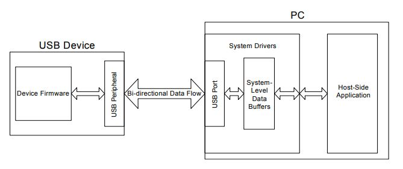

# USB Peripheral Jammer/Helper
## Universal Serial Bros.
### Goals for the Project
We are going to write firmware for a microcontroller so that when plugged into a computer it will move the mouse and type keys at random intervals to make the user of the computer think that they’re going crazy. Towards this, we are going to adapt a generalized USB HID implementation to the specific development board that we are using as well as the computer we are communicating with. Following this, we are going to spend the majority of the project working towards an unprompted interaction between the chosen peripheral and the computer.
### Learning Goals
Primarily, we want to learn the basics of firmware development in C by implementing an existing technology that we are interested, but not well-versed in.
### Re-sourcing our Resources
Because of how complicated we found the USB HID protocol to be, background research was the most involved part of this project and having the right resources proved to be invaluable to our success. As such, we used a variety of resources that we think would be useful for others pursuing a similar project. First, we used a Silicon Labs HID tutorial (https://www.silabs.com/documents/public/application-notes/AN249.pdf) (diagram from this reading below) to get an overview of how the HID protocol worked. We also used the USB HID documentation (http://www.usb.org/developers/hidpage/HID1_11.pdf) to figure out how to control the on screen sprites.This was probably the most thoroughly useful resource that we found and would be the first document we would recommend to those interested in a similar project. Finally, the HID API documentation was useful in giving us an idea of how to override the host USB HID driver in the extension mentioned below (http://www.signal11.us/oss/hidapi/).  

### Finished? Not Quite
We were able to successfully modify a USB HID reference design to either randomly move the mouse or type things on the keyboard depending on which type of peripheral is selected. If a mouse is selected, the onscreen mouse clicks on its own. If the keyboard is selected, a predetermined message is repeatedly typed on its own on screen. The user can easily update the predetermined message because there is a library of characters that are prepared to be included in the message. We also started work on providing feedback from the computer to the USB HID peripheral. On the peripheral side, we receive data from the host before each command send to the host. On the host side, we determined that we would need to use HID API to override the host USB HID driver. We would need to send data packets including relevant status information for the peripheral to use when responding with new control commands.

### Project Accomplishments (Our very own self-congratulatory victory lap in one paragraph)
We did successfully reach our lower bound for what we wanted to accomplish. Although it was initially challenging to understand the HID reference design, once we had an idea of how to control the on screen sprites with the peripheral, the initial program came together quickly. Interestingly, we found that the interesting part of the project was researching and understanding how the USB HID protocol works. Once we had this done, we realized we did not want to waste time on making the on screen sprites do more complicated things. Instead, we decided that we wanted to further develop our knowledge of firmware by modifying the USB HID protocol for two way communications with the hopes of using the result as assistive technology for those who have troubles using the computer on their own. Although we did not end up finishing this, we did achieve our learning goals of developing a better understanding of firmware in C. We are happy that we accomplished more than just our lower bound and are okay that we did not completely reach our upper bound.
